# kaggle-titanic
https://www.kaggle.com/c/titanic
```python
import pandas as pd
import numpy as np
import random as rnd

import seaborn as sns
import matplotlib.pyplot as plt
%matplotlib inline

sns.set_style("white")
survived = ["#ffb3ba", "#bae1ff"]
sns.set_palette(survived)
#sns.palplot(sns.color_palette())

import os
for dirname, _, filenames in os.walk('/kaggle/input'):
    for filename in filenames:
        print(os.path.join(dirname, filename))
        
import warnings
warnings.filterwarnings('ignore')
```

# The Challenge

"The sinking of the Titanic is one of the most infamous shipwrecks in history.

On April 15, 1912, during her maiden voyage, the widely considered “unsinkable” RMS Titanic sank after colliding with an iceberg. Unfortunately, there weren’t enough lifeboats for everyone onboard, resulting in the death of 1502 out of 2224 passengers and crew.

While there was some element of luck involved in surviving, it seems some groups of people were more likely to survive than others.

In this challenge, we ask you to build a predictive model that answers the question: “what sorts of people were more likely to survive?” using passenger data (ie name, age, gender, socio-economic class, etc)."

https://www.kaggle.com/c/titanic/overview/

# Data


```python
train_df = pd.read_csv("train.csv")
test_df = pd.read_csv("test.csv")

train_df.head(10)
```


<div>
<style scoped>
    .dataframe tbody tr th:only-of-type {
        vertical-align: middle;
    }

    .dataframe tbody tr th {
        vertical-align: top;
    }

    .dataframe thead th {
        text-align: right;
    }
</style>
<table border="1" class="dataframe">
  <thead>
    <tr style="text-align: right;">
      <th></th>
      <th>PassengerId</th>
      <th>Survived</th>
      <th>Pclass</th>
      <th>Name</th>
      <th>Sex</th>
      <th>Age</th>
      <th>SibSp</th>
      <th>Parch</th>
      <th>Ticket</th>
      <th>Fare</th>
      <th>Cabin</th>
      <th>Embarked</th>
    </tr>
  </thead>
  <tbody>
    <tr>
      <th>0</th>
      <td>1</td>
      <td>0</td>
      <td>3</td>
      <td>Braund, Mr. Owen Harris</td>
      <td>male</td>
      <td>22.0</td>
      <td>1</td>
      <td>0</td>
      <td>A/5 21171</td>
      <td>7.2500</td>
      <td>NaN</td>
      <td>S</td>
    </tr>
    <tr>
      <th>1</th>
      <td>2</td>
      <td>1</td>
      <td>1</td>
      <td>Cumings, Mrs. John Bradley (Florence Briggs Th...</td>
      <td>female</td>
      <td>38.0</td>
      <td>1</td>
      <td>0</td>
      <td>PC 17599</td>
      <td>71.2833</td>
      <td>C85</td>
      <td>C</td>
    </tr>
    <tr>
      <th>2</th>
      <td>3</td>
      <td>1</td>
      <td>3</td>
      <td>Heikkinen, Miss. Laina</td>
      <td>female</td>
      <td>26.0</td>
      <td>0</td>
      <td>0</td>
      <td>STON/O2. 3101282</td>
      <td>7.9250</td>
      <td>NaN</td>
      <td>S</td>
    </tr>
    <tr>
      <th>3</th>
      <td>4</td>
      <td>1</td>
      <td>1</td>
      <td>Futrelle, Mrs. Jacques Heath (Lily May Peel)</td>
      <td>female</td>
      <td>35.0</td>
      <td>1</td>
      <td>0</td>
      <td>113803</td>
      <td>53.1000</td>
      <td>C123</td>
      <td>S</td>
    </tr>
    <tr>
      <th>4</th>
      <td>5</td>
      <td>0</td>
      <td>3</td>
      <td>Allen, Mr. William Henry</td>
      <td>male</td>
      <td>35.0</td>
      <td>0</td>
      <td>0</td>
      <td>373450</td>
      <td>8.0500</td>
      <td>NaN</td>
      <td>S</td>
    </tr>
    <tr>
      <th>5</th>
      <td>6</td>
      <td>0</td>
      <td>3</td>
      <td>Moran, Mr. James</td>
      <td>male</td>
      <td>NaN</td>
      <td>0</td>
      <td>0</td>
      <td>330877</td>
      <td>8.4583</td>
      <td>NaN</td>
      <td>Q</td>
    </tr>
    <tr>
      <th>6</th>
      <td>7</td>
      <td>0</td>
      <td>1</td>
      <td>McCarthy, Mr. Timothy J</td>
      <td>male</td>
      <td>54.0</td>
      <td>0</td>
      <td>0</td>
      <td>17463</td>
      <td>51.8625</td>
      <td>E46</td>
      <td>S</td>
    </tr>
    <tr>
      <th>7</th>
      <td>8</td>
      <td>0</td>
      <td>3</td>
      <td>Palsson, Master. Gosta Leonard</td>
      <td>male</td>
      <td>2.0</td>
      <td>3</td>
      <td>1</td>
      <td>349909</td>
      <td>21.0750</td>
      <td>NaN</td>
      <td>S</td>
    </tr>
    <tr>
      <th>8</th>
      <td>9</td>
      <td>1</td>
      <td>3</td>
      <td>Johnson, Mrs. Oscar W (Elisabeth Vilhelmina Berg)</td>
      <td>female</td>
      <td>27.0</td>
      <td>0</td>
      <td>2</td>
      <td>347742</td>
      <td>11.1333</td>
      <td>NaN</td>
      <td>S</td>
    </tr>
    <tr>
      <th>9</th>
      <td>10</td>
      <td>1</td>
      <td>2</td>
      <td>Nasser, Mrs. Nicholas (Adele Achem)</td>
      <td>female</td>
      <td>14.0</td>
      <td>1</td>
      <td>0</td>
      <td>237736</td>
      <td>30.0708</td>
      <td>NaN</td>
      <td>C</td>
    </tr>
  </tbody>
</table>
</div>


## Data Types, Describing Data and Missing Values


```python
train_df.info()
print('_'*40)

test_df.info()
```

    <class 'pandas.core.frame.DataFrame'>
    RangeIndex: 891 entries, 0 to 890
    Data columns (total 12 columns):
     #   Column       Non-Null Count  Dtype  
    ---  ------       --------------  -----  
     0   PassengerId  891 non-null    int64  
     1   Survived     891 non-null    int64  
     2   Pclass       891 non-null    int64  
     3   Name         891 non-null    object 
     4   Sex          891 non-null    object 
     5   Age          714 non-null    float64
     6   SibSp        891 non-null    int64  
     7   Parch        891 non-null    int64  
     8   Ticket       891 non-null    object 
     9   Fare         891 non-null    float64
     10  Cabin        204 non-null    object 
     11  Embarked     889 non-null    object 
    dtypes: float64(2), int64(5), object(5)
    memory usage: 83.7+ KB
    ________________________________________
    <class 'pandas.core.frame.DataFrame'>
    RangeIndex: 418 entries, 0 to 417
    Data columns (total 11 columns):
     #   Column       Non-Null Count  Dtype  
    ---  ------       --------------  -----  
     0   PassengerId  418 non-null    int64  
     1   Pclass       418 non-null    int64  
     2   Name         418 non-null    object 
     3   Sex          418 non-null    object 
     4   Age          332 non-null    float64
     5   SibSp        418 non-null    int64  
     6   Parch        418 non-null    int64  
     7   Ticket       418 non-null    object 
     8   Fare         417 non-null    float64
     9   Cabin        91 non-null     object 
     10  Embarked     418 non-null    object 
    dtypes: float64(2), int64(4), object(5)
    memory usage: 36.0+ KB
    


```python
sns.heatmap(train_df.isnull(),yticklabels=False,cbar=False, cmap="Pastel1")
```


    <AxesSubplot:>


    
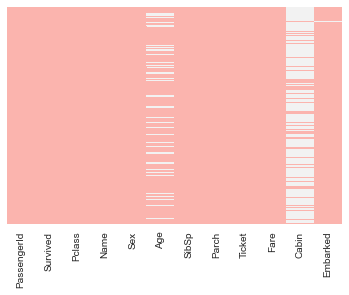
    


> Visually, Cabin features most missing values.

**Analysing Features & Initial Data Presumptions:**

* PassengerId: is a running index (we will drop this feature later on);

* Survived: indication whether the passenger survived (1) or not (0);

* Pclass: Ticket-class: first (1), second (2), and third (3) class tickets. We might assume that first PClass might correlate positively with the Fare feature as a higher class should cost more relative to second or third ticket-classes;

* Name: Name of the passenger. Names contain the family name (indicating possible family relations), titles, such as Mr., Miss., Mrs. (indicating certain age groups or even possibly correlating to Pclass if the name contains a nobility title);

* Sex: indicator whether the passenger was (female) or (male);

* Age: the age in years of the passenger. Listed as a float64, it might be corectly converted to int64 as no decimal age notation was registered. There are 177 NaN values in the train_df and 86 NaN values in the test_df. To estimate some of those missing values, we might use some of the name titles indicating certain age groups;

* SibSp: number of siblings / spouses aboard the Titanic associated with the passenger;

* Parch: number of parents / children aboard the Titanic associated with the passenger;

* Ticket: alphanumeric variable indicating the ticket number. (If totally random, we might as well drop it too later on);

* Fare: how much each passenger paid for the ticket; There's a single missing-value in the test_df;

* Cabin: cabin number of each passenger. Around 77% and 78% of the values are missing for the train_df and test_df respectively;

* Embarked: shows the port of embarkation as a categorical character value. Either (C), (S) or (Q) (C = Cherbourg; Q = Queenstown; S = Southampton);

# Exploratory Data Analysis (EDA)

## How Many Survived?


```python
survived = train_df[train_df['Survived']==1]
not_survived = train_df[train_df['Survived']==0]

print("Survived: %i (%.1f percent)\nNot Survived: %i (%.1f percent)\nTotal: %i"\
      %(len(survived), 1.*len(survived)/len(train_df)*100.0,\
        len(not_survived), 1.*len(not_survived)/len(train_df)*100.0, len(train_df)))
```

    Survived: 342 (38.4 percent)
    Not Survived: 549 (61.6 percent)
    Total: 891
    

In order to have a better predictive algorithm, we must achieve better than 61.6% accuracy. (Same as predicting everyone dies)

## Age Analysis

> Converting Age to integer


```python
g = sns.FacetGrid(train_df, col='Survived',hue='Survived')
g.map(plt.hist, "Age",bins=20);
sns.despine(left = True,bottom = True)

a = sns.FacetGrid(train_df, hue = 'Survived',aspect=2 )
a.map(sns.kdeplot, 'Age', shade= True)
a.set(xlim=(0 , train_df['Age'].max()))
sns.despine(left = True,bottom = True)
```


    
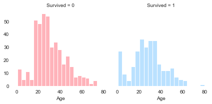
    


    
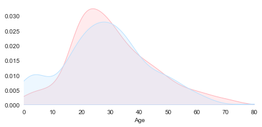
    


> The y-axis of a KDE plot represents the Kernel Density Estimate (KDE) of the Probability Density Function (PDF) of a random variable, interpreted as a probability differential. The probability of a value being between two x values is the total area under the curve.

**Graphical Observations Regarding Age vs Survival Probability**
* Children under 8 years old had high survival rate;
* Passengers above 40 years old had split odds of survival;
* Most passengers that did not survive were between 16 and 32 years old;


> Unfortunatly, around 20% of the combined dataframe does not have an 'Age' value.

## Sex Analysis


```python
ax = sns.countplot(x = 'Sex', hue = 'Survived', data = train_df)
ax.set(xlabel = 'Sex', ylabel='Total')
sns.despine(left = True,bottom = True)
```


    
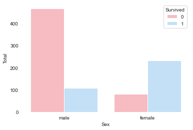
    


Graphical Observations Regarding Sex vs Survival Probability

* 74% of Females Survived vs 19% of Males Survived

## PClass Analysis


```python
sns.barplot(x='Pclass', y='Survived', palette='Pastel1', data=train_df)
sns.despine(left = True,bottom = True)

```


    
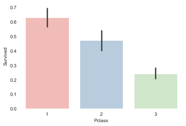
    


## Embarked


```python
sns.barplot(x='Embarked', y='Survived', palette='Pastel1', data=train_df)
sns.despine(left = True,bottom = True)
```


    
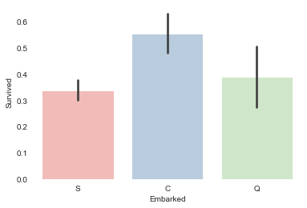
    


## Fare


```python
a = sns.FacetGrid(train_df, hue = 'Survived',aspect=2 )
a.map(sns.kdeplot, 'Fare', shade= True)
a.set(xlim=(0 , train_df['Fare'].max()))
sns.despine(left = True,bottom = True)
```


    
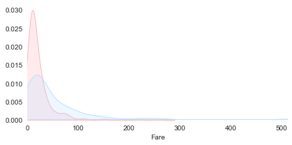
    


```python
a = sns.FacetGrid(train_df, hue = 'Survived',aspect=2 )
a.map(sns.kdeplot, 'Fare', shade= True)
a.set(xlim=(0 , 100))
sns.despine(left = True,bottom = True)
```


    
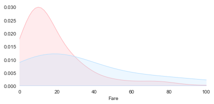
    


```python
f,ax=plt.subplots(1,3,figsize=(20,8))
sns.distplot(train_df[train_df['Pclass']==1].Fare,ax=ax[0], color="#bae1ff")
ax[0].set_title('Fares in Pclass 1')
sns.distplot(train_df[train_df['Pclass']==2].Fare,ax=ax[1],color="#bae1ff")
ax[1].set_title('Fares in Pclass 2')
sns.distplot(train_df[train_df['Pclass']==3].Fare,ax=ax[2],color="#bae1ff")
ax[2].set_title('Fares in Pclass 3')
sns.despine(left = True,bottom = True)
plt.show()
```


    
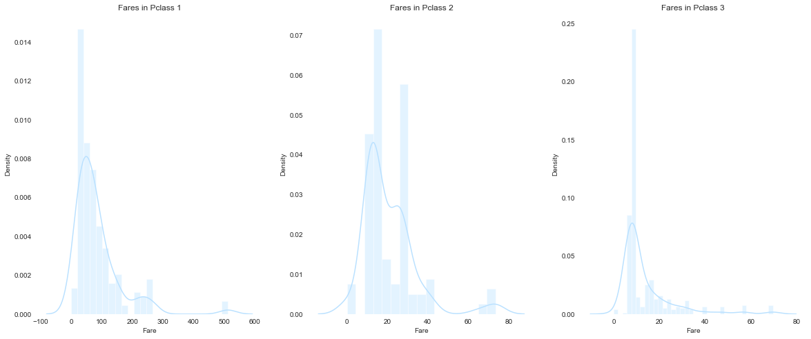
    


# Feature Engineering


```python
train_test_df = [train_df, test_df]
```

## Sex


```python
sex_mapping = {'male': 0, 'female': 1}
for df in train_test_df:
    df['Sex'] = df['Sex'].map(sex_mapping)
```

## Embarked


```python
ax = sns.countplot(x = 'Embarked', hue = 'Pclass', palette='Pastel1', data = train_df)
ax.set(xlabel = 'Embarked', ylabel='Total')
sns.despine(left = True,bottom = True)
```


    
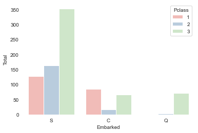
    


```python
train_test_df = [train_df, test_df]

for df in train_test_df:
    df['Embarked'] = df['Embarked'].fillna('S')
```


```python
emb_mapping = {'S': 0, 'C': 1, 'Q': 2}
for df in train_test_df:
    df['Embarked'] = df['Embarked'].map(emb_mapping)
```

## SibSp and Parch Analysis


```python
train_df['FamilySize'] = train_df['SibSp'] + train_df['Parch'] + 1
test_df['FamilySize'] = test_df['SibSp'] + test_df['Parch'] + 1
```


```python
train_df[['FamilySize', 'Survived']].groupby(['FamilySize'], as_index=False).mean().sort_values(by='Survived', ascending=False)
axes = sns.pointplot('FamilySize','Survived', data=train_df)
sns.despine(left = True,bottom = True)
```


    
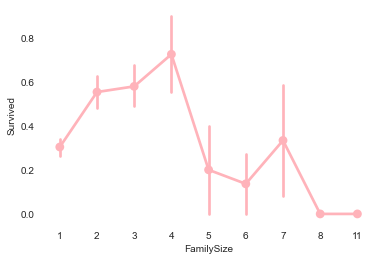
    


```python
facet = sns.FacetGrid(train_df, hue='Survived', aspect=4)
facet.map(sns.kdeplot, 'FamilySize', shade=True)
facet.set(xlim=(0, train_df['FamilySize'].max()))
plt.xlim(0)
sns.despine(left = True,bottom = True)
```


    
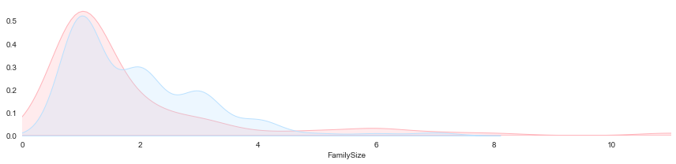
    


```python
train_df = train_df.drop(['Parch','SibSp'], axis=1)
test_df = test_df.drop(['Parch','SibSp'], axis=1)
```

## Name Analysis
In order to fill most accuratly the missing-values associated with Age and further detail our Exploratory Data Analysis, let's extract titles from passenger names. Not only grouping the final result by Pclass should improve our estimates, most importantly we should group by Parch as most definitely it will present the most discrepencies regarding the mean age (e.g. a "Miss" title may translate a group age of either a child, yound-adult or adult, depending whether or not the person is accompanied by other famility members).


```python
train_test_df = [train_df, test_df]

for df in train_test_df:
    df['Title'] = df['Name'].str.extract(' ([A-Za-z]+)\.', expand=False)
```


```python
train_df['Title'].value_counts()
```


    Mr          517
    Miss        182
    Mrs         125
    Master       40
    Dr            7
    Rev           6
    Col           2
    Major         2
    Mlle          2
    Jonkheer      1
    Sir           1
    Mme           1
    Lady          1
    Ms            1
    Countess      1
    Don           1
    Capt          1
    Name: Title, dtype: int64


```python
test_df['Title'].value_counts()
```


    Mr        240
    Miss       78
    Mrs        72
    Master     21
    Rev         2
    Col         2
    Ms          1
    Dr          1
    Dona        1
    Name: Title, dtype: int64


```python
TitleDict = {"Capt": "Officer","Col": "Officer","Major": "Officer","Jonkheer": "Nobility", \
             "Don": "Nobility", "Sir" : "Nobility","Dr": "Nobility","Rev": "Nobility", \
             "Countess":"Nobility", "Mme": "Mrs", "Mlle": "Miss", "Ms": "Mrs","Mr" : "Mr", \
             "Mrs" : "Mrs","Miss" : "Miss","Master" : "Master","Lady" : "Nobility", 'Dona':'Nobility'}

for df in train_test_df:
    df['Title'] = df['Title'].map(TitleDict)
```


```python
sns.barplot(x='Title', y='Survived', palette='Pastel1', data=train_df)
sns.despine(left = True, bottom = True)
```


    
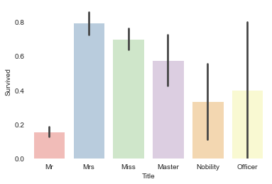
    


```python
title_mapping = {"Master": 0, "Miss": 1, "Mr": 2, "Mrs": 3, "Nobility": 4, "Officer": 5}

for df in train_test_df:
    df['Title'] = df['Title'].map(title_mapping)
```


```python
train_df.drop('Name', axis = 1, inplace = True)
test_df.drop('Name', axis = 1, inplace = True)

train_df.head()
```


<div>
<style scoped>
    .dataframe tbody tr th:only-of-type {
        vertical-align: middle;
    }

    .dataframe tbody tr th {
        vertical-align: top;
    }

    .dataframe thead th {
        text-align: right;
    }
</style>
<table border="1" class="dataframe">
  <thead>
    <tr style="text-align: right;">
      <th></th>
      <th>PassengerId</th>
      <th>Survived</th>
      <th>Pclass</th>
      <th>Sex</th>
      <th>Age</th>
      <th>Ticket</th>
      <th>Fare</th>
      <th>Cabin</th>
      <th>Embarked</th>
      <th>FamilySize</th>
      <th>Title</th>
    </tr>
  </thead>
  <tbody>
    <tr>
      <th>0</th>
      <td>1</td>
      <td>0</td>
      <td>3</td>
      <td>0</td>
      <td>22.0</td>
      <td>A/5 21171</td>
      <td>7.2500</td>
      <td>NaN</td>
      <td>0</td>
      <td>2</td>
      <td>2</td>
    </tr>
    <tr>
      <th>1</th>
      <td>2</td>
      <td>1</td>
      <td>1</td>
      <td>1</td>
      <td>38.0</td>
      <td>PC 17599</td>
      <td>71.2833</td>
      <td>C85</td>
      <td>1</td>
      <td>2</td>
      <td>3</td>
    </tr>
    <tr>
      <th>2</th>
      <td>3</td>
      <td>1</td>
      <td>3</td>
      <td>1</td>
      <td>26.0</td>
      <td>STON/O2. 3101282</td>
      <td>7.9250</td>
      <td>NaN</td>
      <td>0</td>
      <td>1</td>
      <td>1</td>
    </tr>
    <tr>
      <th>3</th>
      <td>4</td>
      <td>1</td>
      <td>1</td>
      <td>1</td>
      <td>35.0</td>
      <td>113803</td>
      <td>53.1000</td>
      <td>C123</td>
      <td>0</td>
      <td>2</td>
      <td>3</td>
    </tr>
    <tr>
      <th>4</th>
      <td>5</td>
      <td>0</td>
      <td>3</td>
      <td>0</td>
      <td>35.0</td>
      <td>373450</td>
      <td>8.0500</td>
      <td>NaN</td>
      <td>0</td>
      <td>1</td>
      <td>2</td>
    </tr>
  </tbody>
</table>
</div>


## Age


```python
train_df_corr = train_df.corr().abs().unstack().sort_values(kind="quicksort", ascending=False).reset_index()
train_df_corr.rename(columns={"level_0": "Feature 1", "level_1": "Feature 2", 0: 'Correlation Coefficient'}, inplace=True)
train_df_corr[train_df_corr['Feature 1'] == 'Age']
```


<div>
<style scoped>
    .dataframe tbody tr th:only-of-type {
        vertical-align: middle;
    }

    .dataframe tbody tr th {
        vertical-align: top;
    }

    .dataframe thead th {
        text-align: right;
    }
</style>
<table border="1" class="dataframe">
  <thead>
    <tr style="text-align: right;">
      <th></th>
      <th>Feature 1</th>
      <th>Feature 2</th>
      <th>Correlation Coefficient</th>
    </tr>
  </thead>
  <tbody>
    <tr>
      <th>7</th>
      <td>Age</td>
      <td>Age</td>
      <td>1.000000</td>
    </tr>
    <tr>
      <th>13</th>
      <td>Age</td>
      <td>Title</td>
      <td>0.510545</td>
    </tr>
    <tr>
      <th>15</th>
      <td>Age</td>
      <td>Pclass</td>
      <td>0.369226</td>
    </tr>
    <tr>
      <th>20</th>
      <td>Age</td>
      <td>FamilySize</td>
      <td>0.301914</td>
    </tr>
    <tr>
      <th>40</th>
      <td>Age</td>
      <td>Fare</td>
      <td>0.096067</td>
    </tr>
    <tr>
      <th>42</th>
      <td>Age</td>
      <td>Sex</td>
      <td>0.093254</td>
    </tr>
    <tr>
      <th>49</th>
      <td>Age</td>
      <td>Survived</td>
      <td>0.077221</td>
    </tr>
    <tr>
      <th>66</th>
      <td>Age</td>
      <td>PassengerId</td>
      <td>0.036847</td>
    </tr>
    <tr>
      <th>78</th>
      <td>Age</td>
      <td>Embarked</td>
      <td>0.010171</td>
    </tr>
  </tbody>
</table>
</div>


```python
train_df.groupby(['Title', 'Pclass','FamilySize'])['Age'].agg(['mean', 'count'])
```


<div>
<style scoped>
    .dataframe tbody tr th:only-of-type {
        vertical-align: middle;
    }

    .dataframe tbody tr th {
        vertical-align: top;
    }

    .dataframe thead th {
        text-align: right;
    }
</style>
<table border="1" class="dataframe">
  <thead>
    <tr style="text-align: right;">
      <th></th>
      <th></th>
      <th></th>
      <th>mean</th>
      <th>count</th>
    </tr>
    <tr>
      <th>Title</th>
      <th>Pclass</th>
      <th>FamilySize</th>
      <th></th>
      <th></th>
    </tr>
  </thead>
  <tbody>
    <tr>
      <th rowspan="5" valign="top">0</th>
      <th rowspan="2" valign="top">1</th>
      <th>3</th>
      <td>4.000000</td>
      <td>1</td>
    </tr>
    <tr>
      <th>4</th>
      <td>5.960000</td>
      <td>2</td>
    </tr>
    <tr>
      <th rowspan="2" valign="top">2</th>
      <th>3</th>
      <td>2.416250</td>
      <td>8</td>
    </tr>
    <tr>
      <th>4</th>
      <td>1.000000</td>
      <td>1</td>
    </tr>
    <tr>
      <th>3</th>
      <th>2</th>
      <td>6.140000</td>
      <td>3</td>
    </tr>
    <tr>
      <th>...</th>
      <th>...</th>
      <th>...</th>
      <td>...</td>
      <td>...</td>
    </tr>
    <tr>
      <th rowspan="3" valign="top">4</th>
      <th>1</th>
      <th>3</th>
      <td>47.000000</td>
      <td>2</td>
    </tr>
    <tr>
      <th rowspan="2" valign="top">2</th>
      <th>1</th>
      <td>42.333333</td>
      <td>6</td>
    </tr>
    <tr>
      <th>2</th>
      <td>41.000000</td>
      <td>2</td>
    </tr>
    <tr>
      <th rowspan="2" valign="top">5</th>
      <th rowspan="2" valign="top">1</th>
      <th>1</th>
      <td>53.250000</td>
      <td>4</td>
    </tr>
    <tr>
      <th>3</th>
      <td>70.000000</td>
      <td>1</td>
    </tr>
  </tbody>
</table>
<p>74 rows × 2 columns</p>
</div>


```python
for df in train_test_df:
    df['Age'].fillna(df.groupby(['Title','Pclass','FamilySize'])['Age'].transform('mean'), inplace=True)
```


```python
for df in train_test_df:
    df['Age'].fillna(df.groupby(['Title','Pclass'])['Age'].transform('mean'), inplace=True)
```


```python
sns.set_style("white")
survived = ["#ffb3ba", "#bae1ff"]
sns.set_palette(survived)
#sns.palplot(sns.color_palette())

g = sns.FacetGrid(train_df, col='Survived',hue='Survived')
g.map(plt.hist, "Age",bins=20);
sns.despine(left = True,bottom = True)

a = sns.FacetGrid(train_df, hue = 'Survived',aspect=2 )
a.map(sns.kdeplot, 'Age', shade= True)
a.set(xlim=(0 , train_df['Age'].max()))
sns.despine(left = True,bottom = True)
```


    
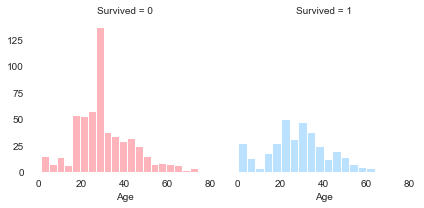
    


    
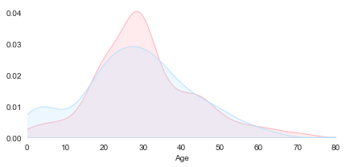
    


```python
facet = sns.FacetGrid(train_df, hue = 'Survived',aspect=2 )
facet.map(sns.kdeplot, 'Age', shade= True)
facet.set(xlim=(0 , train_df['Age'].max()))
sns.despine(left = True,bottom = True)
facet.set(xticks=np.arange(0,21,1))
plt.xlim(0, 16)
```


    (0.0, 16.0)


    
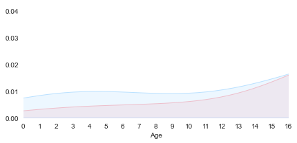
    


```python
facet = sns.FacetGrid(train_df, hue = 'Survived',aspect=2 )
facet.map(sns.kdeplot, 'Age', shade= True)
facet.set(xlim=(0 , train_df['Age'].max()))
sns.despine(left = True,bottom = True)
facet.set(xticks=np.arange(17,35,1))
plt.xlim(17, 34)
```


    (17.0, 34.0)


    
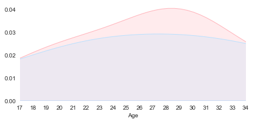
    


```python
facet = sns.FacetGrid(train_df, hue = 'Survived',aspect=2 )
facet.map(sns.kdeplot, 'Age', shade= True)
facet.set(xlim=(0 , train_df['Age'].max()))
sns.despine(left = True,bottom = True)
facet.set(xticks=np.arange(35,61,1))
plt.xlim(35, 60)
```


    (35.0, 60.0)


    
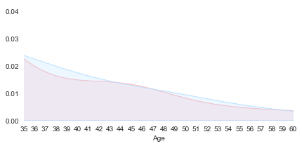
    


```python
facet = sns.FacetGrid(train_df, hue = 'Survived',aspect=2 )
facet.map(sns.kdeplot, 'Age', shade= True)
facet.set(xlim=(0 , train_df['Age'].max()))
sns.despine(left = True,bottom = True)
facet.set(xticks=np.arange(35,61,1))
plt.xlim(35, 60)
```


    (35.0, 60.0)


    

    


```python
for df in train_test_df:
    df.loc[df['Age'] <= 16, 'Age'] = 0
    df.loc[(df['Age'] > 16) & (df['Age'] <= 34), 'Age'] = 1
    df.loc[(df['Age'] > 34) & (df['Age'] <= 43), 'Age'] = 2
    df.loc[(df['Age'] > 43) & (df['Age'] <= 60), 'Age'] = 3
    df.loc[df['Age'] > 60, 'Age'] = 4
```

## Fare


```python
test_df['Fare'].fillna(test_df.groupby(['Pclass'])['Fare'].transform('median'), inplace=True)
```


```python
facet = sns.FacetGrid(train_df, hue = 'Survived',aspect=2 )
facet.map(sns.kdeplot, 'Fare', shade= True)
facet.set(xlim=(0 , train_df['Fare'].max()))
sns.despine(left = True,bottom = True)
facet.set(xticks=np.arange(0,21,1))
plt.xlim(0,17)
```


    (0.0, 17.0)


    
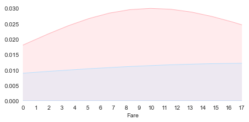
    


```python
facet = sns.FacetGrid(train_df, hue = 'Survived',aspect=2 )
facet.map(sns.kdeplot, 'Fare', shade= True)
facet.set(xlim=(0 , train_df['Fare'].max()))
sns.despine(left = True,bottom = True)
facet.set(xticks=np.arange(17,31,1))
plt.xlim(17,30)
```


    (17.0, 30.0)


    
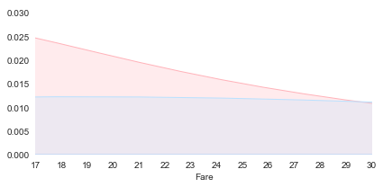
    


```python
train_test_df = [train_df, test_df]

for df in train_test_df:
    df.loc[df['Fare'] <= 17, 'Fare'] = 0
    df.loc[(df['Fare'] > 17) & (df['Fare'] <= 30), 'Fare'] = 1
    df.loc[(df['Fare'] > 30) & (df['Age'] <= 100), 'Fare'] = 2
    df.loc[df['Fare'] > 100, 'Fare'] = 3
```


```python
train_df.head()
```


<div>
<style scoped>
    .dataframe tbody tr th:only-of-type {
        vertical-align: middle;
    }

    .dataframe tbody tr th {
        vertical-align: top;
    }

    .dataframe thead th {
        text-align: right;
    }
</style>
<table border="1" class="dataframe">
  <thead>
    <tr style="text-align: right;">
      <th></th>
      <th>PassengerId</th>
      <th>Survived</th>
      <th>Pclass</th>
      <th>Sex</th>
      <th>Age</th>
      <th>Ticket</th>
      <th>Fare</th>
      <th>Cabin</th>
      <th>Embarked</th>
      <th>FamilySize</th>
      <th>Title</th>
    </tr>
  </thead>
  <tbody>
    <tr>
      <th>0</th>
      <td>1</td>
      <td>0</td>
      <td>3</td>
      <td>0</td>
      <td>1.0</td>
      <td>A/5 21171</td>
      <td>0.0</td>
      <td>NaN</td>
      <td>0</td>
      <td>2</td>
      <td>2</td>
    </tr>
    <tr>
      <th>1</th>
      <td>2</td>
      <td>1</td>
      <td>1</td>
      <td>1</td>
      <td>2.0</td>
      <td>PC 17599</td>
      <td>2.0</td>
      <td>C85</td>
      <td>1</td>
      <td>2</td>
      <td>3</td>
    </tr>
    <tr>
      <th>2</th>
      <td>3</td>
      <td>1</td>
      <td>3</td>
      <td>1</td>
      <td>1.0</td>
      <td>STON/O2. 3101282</td>
      <td>0.0</td>
      <td>NaN</td>
      <td>0</td>
      <td>1</td>
      <td>1</td>
    </tr>
    <tr>
      <th>3</th>
      <td>4</td>
      <td>1</td>
      <td>1</td>
      <td>1</td>
      <td>2.0</td>
      <td>113803</td>
      <td>2.0</td>
      <td>C123</td>
      <td>0</td>
      <td>2</td>
      <td>3</td>
    </tr>
    <tr>
      <th>4</th>
      <td>5</td>
      <td>0</td>
      <td>3</td>
      <td>0</td>
      <td>2.0</td>
      <td>373450</td>
      <td>0.0</td>
      <td>NaN</td>
      <td>0</td>
      <td>1</td>
      <td>2</td>
    </tr>
  </tbody>
</table>
</div>


```python
train_df.drop(['PassengerId','Ticket','Cabin'], axis = 1, inplace = True)
test_df.drop(['Ticket','Cabin'], axis = 1, inplace = True)
```

## Modelling


```python
from sklearn.linear_model import LogisticRegression
from sklearn.svm import LinearSVC
from sklearn.ensemble import RandomForestClassifier
from sklearn.neighbors import KNeighborsClassifier
from sklearn.naive_bayes import GaussianNB
from sklearn.linear_model import Perceptron
from sklearn.linear_model import SGDClassifier
from sklearn.tree import DecisionTreeClassifier
```


```python
X_train = train_df.drop("Survived", axis=1)
Y_train = train_df["Survived"]
X_test  = test_df.drop("PassengerId", axis=1).copy()
X_train.shape, Y_train.shape, X_test.shape
```


    ((891, 7), (891,), (418, 7))


```python
X_test.info()
```

    <class 'pandas.core.frame.DataFrame'>
    RangeIndex: 418 entries, 0 to 417
    Data columns (total 7 columns):
     #   Column      Non-Null Count  Dtype  
    ---  ------      --------------  -----  
     0   Pclass      418 non-null    int64  
     1   Sex         418 non-null    int64  
     2   Age         418 non-null    float64
     3   Fare        418 non-null    float64
     4   Embarked    418 non-null    int64  
     5   FamilySize  418 non-null    int64  
     6   Title       418 non-null    int64  
    dtypes: float64(2), int64(5)
    memory usage: 23.0 KB
    

## Logistic Regression


```python
logreg = LogisticRegression()
logreg.fit(X_train, Y_train)
Y_pred = logreg.predict(X_test)
acc_log = round(logreg.score(X_train, Y_train) * 100, 2)
acc_log
```


    79.8


## SVM


```python
svc = LinearSVC()
svc.fit(X_train, Y_train)
Y_pred = svc.predict(X_test)
acc_svc = round(svc.score(X_train, Y_train) * 100, 2)
acc_svc
```


    80.02


## KNN


```python
knn = KNeighborsClassifier(n_neighbors = 3)
knn.fit(X_train, Y_train)
Y_pred = knn.predict(X_test)
acc_knn = round(knn.score(X_train, Y_train) * 100, 2)
acc_knn
```


    85.19


## Naive Bayes


```python
gaussian = GaussianNB()
gaussian.fit(X_train, Y_train)
Y_pred = gaussian.predict(X_test)
acc_gaussian = round(gaussian.score(X_train, Y_train) * 100, 2)
acc_gaussian
```


    78.0


# Perceptron


```python
perceptron = Perceptron()
perceptron.fit(X_train, Y_train)
Y_pred = perceptron.predict(X_test)
acc_perceptron = round(perceptron.score(X_train, Y_train) * 100, 2)
acc_perceptron
```


    72.5


## Linear SVC


```python
linear_svc = LinearSVC()
linear_svc.fit(X_train, Y_train)
Y_pred = linear_svc.predict(X_test)
acc_linear_svc = round(linear_svc.score(X_train, Y_train) * 100, 2)
acc_linear_svc
```


    80.02


## SGD


```python
sgd = SGDClassifier()
sgd.fit(X_train, Y_train)
Y_pred = sgd.predict(X_test)
acc_sgd = round(sgd.score(X_train, Y_train) * 100, 2)
acc_sgd
```


    75.42


## Decision Tree


```python
decision_tree = DecisionTreeClassifier()
decision_tree.fit(X_train, Y_train)
Y_pred = decision_tree.predict(X_test)
acc_decision_tree = round(decision_tree.score(X_train, Y_train) * 100, 2)
acc_decision_tree
```


    88.1


## Random Forest


```python
random_forest = RandomForestClassifier(n_estimators=3)
random_forest.fit(X_train, Y_train)
Y_pred = random_forest.predict(X_test)
random_forest.score(X_train, Y_train)
acc_random_forest = round(random_forest.score(X_train, Y_train) * 100, 2)
acc_random_forest
```


    86.76


```python
submission = pd.DataFrame({
        "PassengerId": test_df["PassengerId"],
        "Survived": Y_pred
    })
submission.to_csv('submissionRF.csv', index=False)
```


```python
models = pd.DataFrame({
    'Model': ['Support Vector Machines', 'KNN', 'Logistic Regression', 
              'Random Forest', 'Naive Bayes', 'Perceptron', 
              'Stochastic Gradient Decent', 'Linear SVC', 
              'Decision Tree'],
    'Score': [acc_svc, acc_knn, acc_log, 
              acc_random_forest, acc_gaussian, acc_perceptron, 
              acc_sgd, acc_linear_svc, acc_decision_tree]})
models.sort_values(by='Score', ascending=False)
```


<div>
<style scoped>
    .dataframe tbody tr th:only-of-type {
        vertical-align: middle;
    }

    .dataframe tbody tr th {
        vertical-align: top;
    }

    .dataframe thead th {
        text-align: right;
    }
</style>
<table border="1" class="dataframe">
  <thead>
    <tr style="text-align: right;">
      <th></th>
      <th>Model</th>
      <th>Score</th>
    </tr>
  </thead>
  <tbody>
    <tr>
      <th>8</th>
      <td>Decision Tree</td>
      <td>88.10</td>
    </tr>
    <tr>
      <th>3</th>
      <td>Random Forest</td>
      <td>86.76</td>
    </tr>
    <tr>
      <th>1</th>
      <td>KNN</td>
      <td>85.19</td>
    </tr>
    <tr>
      <th>0</th>
      <td>Support Vector Machines</td>
      <td>80.02</td>
    </tr>
    <tr>
      <th>7</th>
      <td>Linear SVC</td>
      <td>80.02</td>
    </tr>
    <tr>
      <th>2</th>
      <td>Logistic Regression</td>
      <td>79.80</td>
    </tr>
    <tr>
      <th>4</th>
      <td>Naive Bayes</td>
      <td>78.00</td>
    </tr>
    <tr>
      <th>6</th>
      <td>Stochastic Gradient Decent</td>
      <td>75.42</td>
    </tr>
    <tr>
      <th>5</th>
      <td>Perceptron</td>
      <td>72.50</td>
    </tr>
  </tbody>
</table>
</div>


## Cross Validation (K-Fold)


```python
from sklearn.model_selection import StratifiedKFold
from sklearn.model_selection import cross_val_score

k_fold = StratifiedKFold(n_splits = 10, shuffle = True, random_state = 1)
```


```python
from sklearn.model_selection import cross_val_score
rf = RandomForestClassifier(n_estimators=3)
scores = cross_val_score(rf, X_train, Y_train, cv=10, scoring = "accuracy")
print("Scores:", scores)
print("Mean:", scores.mean())
print("Standard Deviation:", scores.std())
```

    Scores: [0.76666667 0.80898876 0.74157303 0.82022472 0.84269663 0.78651685
     0.80898876 0.75280899 0.80898876 0.80898876]
    Mean: 0.7946441947565543
    Standard Deviation: 0.030334789759678862
    


```python
importances = pd.DataFrame({'feature':X_train.columns,'Importance':np.round(random_forest.feature_importances_,3)})
importances = importances.sort_values('Importance',ascending=False).set_index('feature')
importances.head(7)
```


<div>
<style scoped>
    .dataframe tbody tr th:only-of-type {
        vertical-align: middle;
    }

    .dataframe tbody tr th {
        vertical-align: top;
    }

    .dataframe thead th {
        text-align: right;
    }
</style>
<table border="1" class="dataframe">
  <thead>
    <tr style="text-align: right;">
      <th></th>
      <th>Importance</th>
    </tr>
    <tr>
      <th>feature</th>
      <th></th>
    </tr>
  </thead>
  <tbody>
    <tr>
      <th>Title</th>
      <td>0.248</td>
    </tr>
    <tr>
      <th>Sex</th>
      <td>0.235</td>
    </tr>
    <tr>
      <th>FamilySize</th>
      <td>0.179</td>
    </tr>
    <tr>
      <th>Age</th>
      <td>0.100</td>
    </tr>
    <tr>
      <th>Pclass</th>
      <td>0.095</td>
    </tr>
    <tr>
      <th>Fare</th>
      <td>0.081</td>
    </tr>
    <tr>
      <th>Embarked</th>
      <td>0.062</td>
    </tr>
  </tbody>
</table>
</div>


## Grid Search


```python
from sklearn.model_selection import GridSearchCV
```


```python
parameters = {'n_estimators': (10,30,50,70,90,100),
             'criterion': ('gini', 'entropy'),
             'max_depth': (3,5,7,9,10),
             'max_features': ('auto', 'sqrt'),
             'min_samples_split': (2,4,6)
             }
```


```python
RF_grid = GridSearchCV(RandomForestClassifier(n_jobs = -1, oob_score = False), param_grid = parameters, cv = 3, verbose = True)
```


```python
RF_grid_model = RF_grid.fit(X_train, Y_train)
```

    Fitting 3 folds for each of 360 candidates, totalling 1080 fits
    

    [Parallel(n_jobs=1)]: Using backend SequentialBackend with 1 concurrent workers.
    [Parallel(n_jobs=1)]: Done 1080 out of 1080 | elapsed:  1.5min finished
    


```python
RF_grid_model.best_estimator_
```


    RandomForestClassifier(criterion='entropy', max_depth=5, n_estimators=10,
                           n_jobs=-1)


```python
RF_grid_model.best_score_
```


    0.839506172839506


## Model Evaluation

## Confusion Matrix


```python
from sklearn.model_selection import cross_val_predict
from sklearn.metrics import confusion_matrix
predictions = cross_val_predict(random_forest, X_train, Y_train, cv=3)
confusion_matrix(Y_train, predictions)
```


    array([[476,  73],
           [107, 235]], dtype=int64)


## Precision and Recall


```python
from sklearn.metrics import precision_score, recall_score

print("Precision:", precision_score(Y_train, predictions))
print("Recall:",recall_score(Y_train, predictions))
```

    Precision: 0.762987012987013
    Recall: 0.6871345029239766
    

## F-Score


```python
from sklearn.metrics import f1_score
f1_score(Y_train, predictions)
```


    0.7230769230769231


## Precision Recall Curve


```python
from sklearn.metrics import precision_recall_curve

# getting the probabilities of our predictions
y_scores = random_forest.predict_proba(X_train)
y_scores = y_scores[:,1]

precision, recall, threshold = precision_recall_curve(Y_train, y_scores)
def plot_precision_and_recall(precision, recall, threshold):
    plt.plot(threshold, precision[:-1], "r-", label="precision", linewidth=5)
    plt.plot(threshold, recall[:-1], "b", label="recall", linewidth=5)
    plt.xlabel("threshold", fontsize=19)
    plt.legend(loc="upper right", fontsize=19)
    plt.ylim([0, 1])

plt.figure(figsize=(14, 7))
plot_precision_and_recall(precision, recall, threshold)
plt.show()
```


    
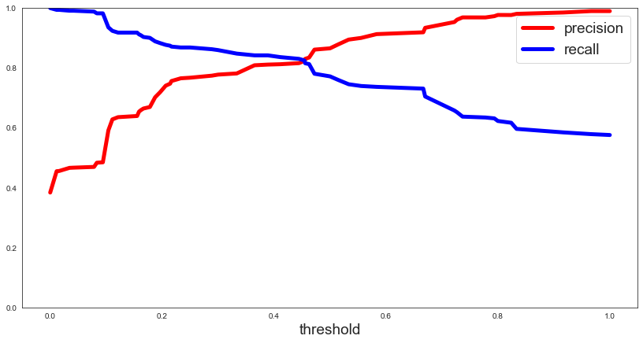
    


```python
def plot_precision_vs_recall(precision, recall):
    plt.plot(recall, precision, "g--", linewidth=2.5)
    plt.ylabel("recall", fontsize=19)
    plt.xlabel("precision", fontsize=19)
    plt.axis([0, 1.5, 0, 1.5])

plt.figure(figsize=(14, 7))
plot_precision_vs_recall(precision, recall)
plt.show()
```


    
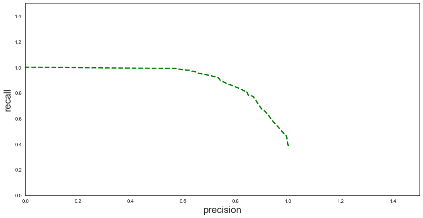
    


## ROC AUC Curve


```python
from sklearn.metrics import roc_curve
# compute true positive rate and false positive rate
false_positive_rate, true_positive_rate, thresholds = roc_curve(Y_train, y_scores)
# plotting them against each other
def plot_roc_curve(false_positive_rate, true_positive_rate, label=None):
    plt.plot(false_positive_rate, true_positive_rate, linewidth=2, label=label)
    plt.plot([0, 1], [0, 1], 'r', linewidth=4)
    plt.axis([0, 1, 0, 1])
    plt.xlabel('False Positive Rate (FPR)', fontsize=16)
    plt.ylabel('True Positive Rate (TPR)', fontsize=16)

plt.figure(figsize=(14, 7))
plot_roc_curve(false_positive_rate, true_positive_rate)
plt.show()
```


    
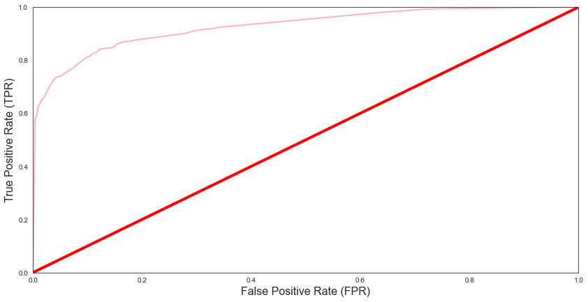
    


```python
from sklearn.metrics import roc_auc_score
r_a_score = roc_auc_score(Y_train, y_scores)
print("ROC-AUC-Score:", r_a_score)
```

    ROC-AUC-Score: 0.926447874391504
    
